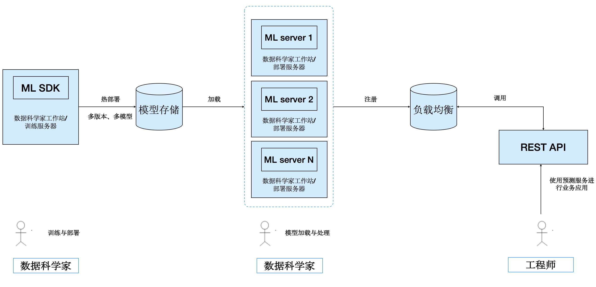

# AIFly

该框架可以轻松实现机器学习模型的发布、管理、应用与API的生成，其中API包括REST服务和本地服务，数据科学家只需专心研究算法和建模。

## 快速使用说明

以下测试帮助实现本地机器的实现

### 安装

- python setup.py install
  - 安装模型发布接口
  - 安装模型预测接口

### 步骤

- 模型发布
- 模型调用

### 1. 模型发布

- 配置文件
  - 指定存储方式(local_fs：本地)
  - 存储位置：./tmp/model_repo

```yaml
#配置文件：AIFlyapi_config.yaml
model_storage:
  backend: "local_fs"
  local_fs:
    modelrepo_dir: "./tmp/model_repo"
model_loader:
    working_dir: "/tmp"
```

- 模型发布(前两种为local)
  - 方式1：直接部署模型class（需要有predict函数）

  ```python
  import json
  from AIFlysdk.AIFlyApi import AIFlyApi
  class HelloWorldModel:
      def predict(self, input):
          return json.dumps("Hello World")

  model = HelloWorldModel()
  print "Local Prediction:", model.predict(None)
  publish_init=AIFlyApi(config='AIFlyapi_config.yaml')
  publish_init.publish_model(model, "HelloWorldExample", "1.0.1")
  ```

  - 方式2：单独编写部署class，模版如下

  ```Python
  """模型定义"""
  #定义模型加载
  def load_model(model_dir):
      return fib(model_dir)

  #定义预测函数
  class fib:
      def __init__(self,model_dir):
          self.model_dir=None

      def predict(self, n):
          if n == 0 or n == 1:
              return 1
          else:
              return self.predict(n-1) + self.predict(n-2)
  """模型发布"""        
  #告知预测函数和模型文件的路径
  publish_init=AIFlyApi(config='config/AIFlyapi_config.yaml')
  dir_path='/Users/leepand/Downloads/BigRLab_APIs/demoday_fs/web_lab/AIaas/AIserver/AIaasFly/AIFlysdk'
  publish_init.publish_asm_model(path_to_prediction_module=dir_path+'/model/pred/fib.py',
              path_to_model_resources_dir=dir_path+'/model/model',
              model_id="fib_model",
                      model_version="1.0.2")
  ```

  - 方式3：REST

  ```Python
  import requests
  import json
  routing_del={'model_list':[['fib_model','1.0.2']]}
  r = requests.put('http://localhost:8000/AI_server/predict/',data = json.dumps(routing_del))
  r.content
  ```

### 2. 模型调用

- local

```Python
from AIFlylocal.AIFlylocal import PredictServer
model_local_server=PredictServer('AIFlyapi_config.yaml')
load_model=model_local_server.load_models([["HelloWorldExample", "1.0.1"],["fib_model","1.0.2"]])
#'{"Init Model Service": "Success"}'
model_local_server.predict(31,modelId="fib_model",model_version="1.0.2")

#'{"result": 2178309}'
```

- REST

```python
import time
t1=time.time()
d3 = {'modelId':'fib_model','model_version':'1.0.2', 'data':31}
response =requests.post('http://localhost:8000/AI_server/predict/', 
                         data= json.dumps(d3), 
                         headers={'Content-Type': 'application/json'})
print(response.status_code)
print(response.content)
print(time.time()-t1)

200
{"result": 2178309}
0.901387929916
```

### 架构

#### End-to-End Workflow



### TODO

- ~~负载均衡信息持久化(redis)~~
- ~~服务探活、并与负载分离~~
- ~~增加模型信息移除~~
- 管理信息可视化
- 加入train环节和model管理